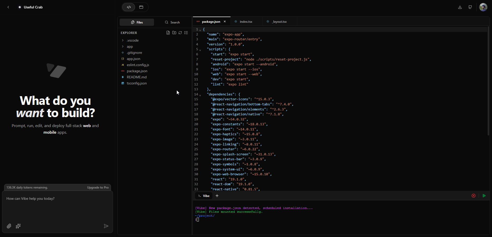

# 🚀 Vibe: The Evolution of Browser-Based AI Development

[](https://nextjs.org/)
[](https://www.typescriptlang.org/)
[](https://www.prisma.io/)
[](LICENSE)

**Vibe** is an ambitious, high-performance, and AI-first coding platform that eliminates the barrier between ideation and production. By running a full-stack **Node.js runtime (WebContainer)** directly within the user's browser thread and pairing it with **Advanced Generative AI**, Vibe allows developers to build, test, and deploy entire applications using nothing but natural language and a browser tab.



---

## 🌟 Vision & Purpose
Most IDEs require heavy local setups, complex containerization, or expensive remote VMs. Vibe flips the script:
1. **Zero Configuration**: No `node_modules` on your disk. No Docker containers to manage.
2. **AI-Native Workflow**: The AI isn't just a chatbot; it's a collaborator that has direct access to your file system and terminal.
3. **Instant Manifestation**: Changes aren't just suggested—they are applied, built, and hot-swapped in milliseconds.

---

## 🏗️ Technical Architecture Details

Vibe is constructed using a modern, distributed architecture that balances client-side power with server-side intelligence.

### 1. The Browser Engine (The "Frontend")
- **WebContainer**: A POSIX-compliant operating system runtime that boots in milliseconds. It handles all file system operations, networking, and shell execution.
- **CodeMirror 6**: A state-of-the-art modular text editor providing a desktop-class coding experience with support for thousands of languages.
- **XTerm.js**: The industry standard for terminal emulation, providing full ANSI color support and low-latency interaction.
- **Zustand State Engine**: Every keystroke, file change, and AI interaction is managed through a centralized, reactive store.

### 2. The AI & Processing Layer (The "Intelligence")
- **Google Gemini Pro (Vision & Text)**: Our primary LLM provider. Vibe uses specific prompt orchestration to ensure the AI generates "Artifacts"—atomic, parseable code blocks that represent file changes.
- **Nebius / Deepgram**: Used for auxiliary AI tasks like audio processing or advanced inference optimization.

### 3. The Persistence Layer (The "Backend")
- **Prisma & PostgreSQL**: A robust relational database schema that tracks every workspace, user credit, and message history.
- **Better Auth**: A developer-friendly authentication framework that secures the platform while allowing seamless OAuth integration with Google and GitHub.

---

## ⚙️ Detailed Setup & Installation

Follow these steps to get your own instance of Vibe running locally for development.

### 1. Repository Setup

The first step is to bring the Vibe source code to your local machine using Git.

```bash
# Clone the repository from GitHub
# This downloads the entire project history and all branch information.
git clone https://github.com/vibe-org/vibe-coding-platform.git

# Navigate into the project directory
cd vibe-coding-platform
```

### 2. Dependency Management

Vibe is optimized for **Bun**, but it also supports traditional Node.js/npm. Bun is recommended for its significantly faster installation speeds and runtime performance.

```bash
# install via Bun (Recommended)
bun install

# OR via npm
npm install
```

### 3. Environment Configuration (`.env`)

Vibe requires several external services to function. Copy the example file and fill in your credentials.

```bash
cp .env.example .env
```

#### 🔑 Required Variables Explained:

| Variable | Description | Where to get it |
| :--- | :--- | :--- |
| `DATABASE_URL` | Connection string for your PostgreSQL database. | [Neon](https://neon.tech) or local Postgres. |
| `BETTER_AUTH_SECRET` | A 32-character random string used for session encryption. | Any random generator. |
| `BETTER_AUTH_URL` | The base URL of your app in development. | `http://localhost:3000` |
| `GOOGLE_API_KEY` | Your primary key for Gemini AI. Supports comma-separated keys for load balancing. | [Google AI Studio](https://aistudio.google.com) |
| `GITHUB_CLIENT_ID/SECRET` | Used for linking workspaces to GitHub repositories. | [GitHub Developer Settings](https://github.com/settings/developers) |
| `CLOUDINARY_API_...` | Used for managing user images and asset hosting. | [Cloudinary Dashboard](https://cloudinary.com) |
| `NEBIUS_API_KEY` | (Optional) Secondary LLM provider API key. | [Nebius AI](https://nebius.ai) |

### 4. Database Initialization

Since Vibe is a data-driven platform, you must initialize your schema.

```bash
# Sync your database with the Prisma schema
bun db:migrate

# Generate the Prisma client so TypeScript understands your models
bun db:generate
```

### 5. Launch

```bash
# Start the Next.js development server
bun dev
```
Navigate to `http://localhost:3000` to start building!

---

## 🗂️ Project Structure Deep-Dive

For contributors, here is how the Vibe codebase is organized:

```text
vibe-coding-platform/
├── app/                  # Next.js 16 App Router
│   ├── (auth)/          # Authentication flow (Login, Register)
│   ├── (main)/          # Dashboard, Workspaces, Account
│   ├── api/             # API routes (Workspaces, AI, GitHub)
│   └── layout.tsx       # Root layout with providers
├── features/             # Business Logic Domains
│   ├── editor/          # CodeMirror implementation
│   ├── chat/            # AI interaction & Artifact parsing
│   └── terminal/        # XTerm.js setup
├── components/           # UI Components
│   ├── ui/              # shadcn UI primitives
│   └── footer/header    # Common page elements
├── lib/                  # Universal Utilities
│   ├── webcontainer.ts  # The Runtime manager
│   ├── credits.ts       # Credit management logic
│   └── github.ts        # Git sync service
├── prisma/               # Database Schema
└── context/              # Global State (Zustand & React Context)
```

---

## 🛡️ Trust, Reliability & Credit System

### The Vibe Credit System
To ensure fair use of our AI resources, Vibe implements a robust credit system.
- **Initial Grant**: 150,000 credits upon registration.
- **Consumption**: Credits are consumed based on the token count of AI interactions.
- **Auto-Refresh**: Balances are periodically refreshed through a backend cron-like process (see `lib/credits.ts`).

### Data Security
- Every Workspace is uniquely owned and private.
- Better Auth ensures state-of-the-art session management.
- External API keys (like Google or GitHub) are never stored in plain text—they are managed through environment variables on the server.

---

## 🤝 Community & Support

- **Bug Reports**: Use the [Issue Tracker](https://github.com/vibe-org/vibe-coding-platform/issues).
- **Proposals**: Start a discussion for new framework support (Astro, Svelte, etc).
- **Discord**: Join the movement at [discord.gg/vibe](#).

---

**Crafted with obsession by the Vibe Core Team.**
