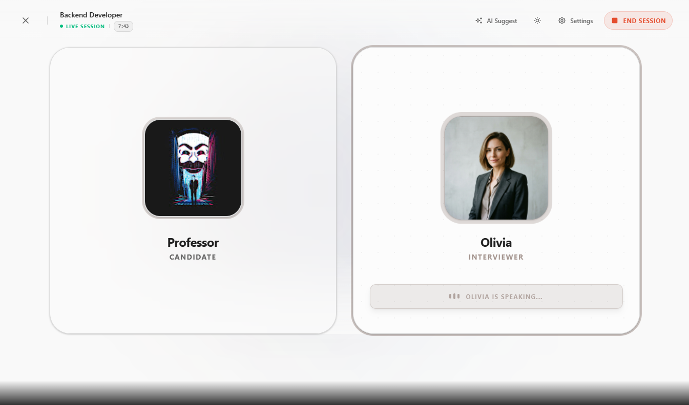
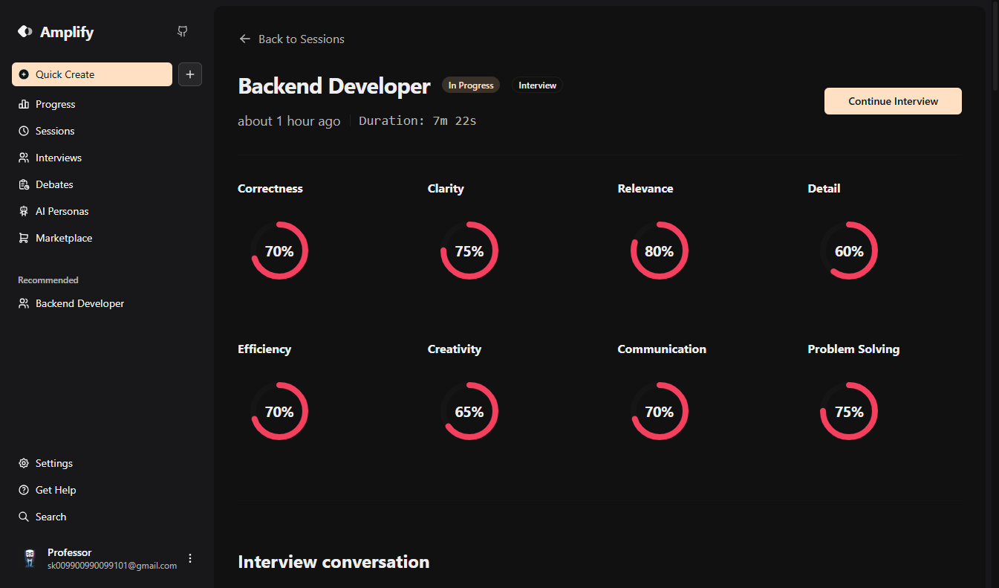
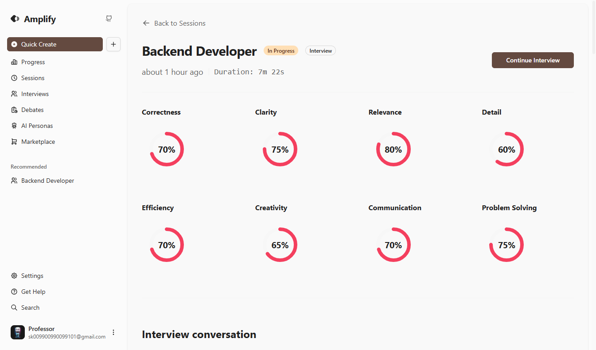
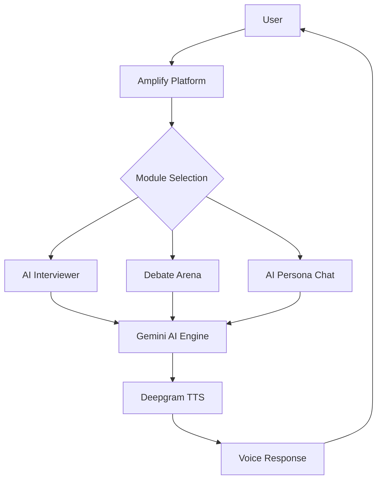

# Amplify: Own Your Voice 🎙️

**Amplify** is a state-of-the-art, AI-augmented communication laboratory designed to transform how individuals express their ideas. From the high-pressure environment of executive interviews to the intellectual rigor of the **Debate Arena**, Amplify provides a sophisticated sandbox for cognitive and verbal mastery.

Leveraging the precision of **Google Gemini** and the natural resonance of **Deepgram**, we bridge the gap between thought and expression, empowering you to truly **Own Your Voice**.

## 📸 App Demos

| Light Mode | Dark Mode |
| :---: | :---: |
|  |  |

| Dark Mode | Light Mode |
| :---: | :---: |
|  |  |

## 🌟 Key Modules

### 🎤 AI Interviews
Practice with industry-specific interviewers. Receive real-time feedback on your answers, clarity, and technical accuracy. Receive a detailed verdict at the end of each session.

### ⚔️ Debate Arena
Engage in structured debates against multiple AI opponents. Improve your argumentation, rebuttal speed, and topical knowledge. A neutral AI judge provides feedback on your performance.

### 🎭 AI Personas & Marketplace
Create your own specialized AI agents or browse the **Marketplace** for community-created personas. From historical figures to technical experts, practice communicating with anyone.

## 🚀 Features

- **Personalized Progress Tracking**: Monitor your growth with interactive dashboards and skill-specific analytics.
- **AI-Powered Insights**: Receive instant, actionable feedback on fluency, clarity, and relevance.
- **Dynamic Character Selection**: Pick from a wide range of characters, each with unique voices and personalities.
- **Marketplace Integration**: Install, rate, and review community-shared personas and templates.
- **Modern, Accessible UI**: A sleek, premium interface built with glassmorphism and motion tools.

## Interaction Flow



## 🛠️ Technology Stack

- **Framework**: [Next.js 15](https://nextjs.org) (App Router)
- **Database**: [Prisma](https://prisma.io) with PostgreSQL (Neon)
- **AI Engine**: [Google Gemini AI](https://ai.google.dev/)
- **Voice Synthesis**: [Deepgram](https://deepgram.com)
- **Styling**: [Tailwind CSS 4](https://tailwindcss.com) & [Shadcn UI](https://ui.shadcn.com)
- **Authentication**: [Better Auth](https://better-auth.com)
- **Animations**: [Motion](https://motion.dev)

## 🏁 Getting Started

### Prerequisites

Ensure you have [Node.js](https://nodejs.org) and [Bun](https://bun.sh) installed.

### Installation

1. **Clone the repository**:
   ```bash
   git clone https://github.com/lwshakib/amplify-own-your-voice.git
   cd amplify-own-your-voice
   ```

2. **Install dependencies**:
   ```bash
   bun install
   ```

3. **Environment Setup**:
   Create a `.env` file based on `.env.example` and fill in your API keys.

4. **Database Setup**:
   ```bash
   bun x prisma generate
   bun x prisma db push
   ```

5. **Run the development server**:
   ```bash
   bun dev
   ```

6. Open [http://localhost:3000](http://localhost:3000) with your browser.

## 🤝 Contributing

Contributions are welcome! Please check our [CONTRIBUTING.md](CONTRIBUTING.md) for guidelines and our [CODE_OF_CONDUCT.md](CODE_OF_CONDUCT.md).

## 📄 License

This project is private and owned by [lwshakib](https://github.com/lwshakib).
